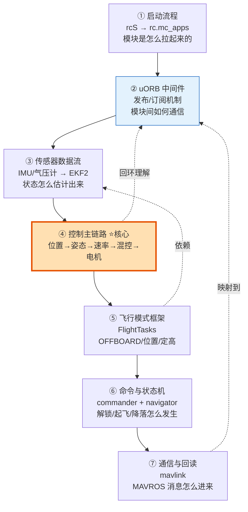

---
tags:
  - PX4
  - 源码学习
  - uORB
  - 控制算法
  - EKF2
  - 架构
  - 学习路线
date: 2026-08-13
---

# PX4 源码导读与学习路线图

> 来源：PX4-Autopilot v1.14.3 源码（~/workspace/PX4-Autopilot） | 自研学习路线总结

---

## 零、写在前面：读 PX4 源码的正确姿势

PX4 是一个**数十万行 C++ 的飞控系统**，一次性通读不现实，也记不住。正确做法是：

1. **先懂架构分层**——知道"谁调用谁"，否则一头扎进某个 `.cpp` 会迷路。
2. **沿"控制主链路"读**——从"飞机怎么动起来"这条主线切入，而不是从 main() 硬啃。
3. **uORB 是主线索引**——PX4 模块之间靠 uORB（发布/订阅）解耦，搞清楚数据流，就读懂了 80%。

> 本文基于你本机的 **PX4 v1.14.3**，路径都以 `~/workspace/PX4-Autopilot` 为根。

---

## 一、PX4 整体架构（四层）

```
┌────────────────────────────────────────────────────────────┐
│  应用层  (src/modules/)                                     │
│  commander  navigator  mc_pos_control  mc_att_control      │
│  mc_rate_control  mavlink  ekf2  logger  ...               │
├────────────────────────────────────────────────────────────┤
│  中间件  (uORB / msg/)                                      │
│  发布/订阅消息总线：vehicle_local_position, vehicle_command │
│  vehicle_attitude_setpoint, actuator_controls ...          │
├────────────────────────────────────────────────────────────┤
│  驱动层  (src/drivers/)                                     │
│  IMU/陀螺/气压计/GPS/电调(DSHOT/PWM)/RC 输入 ...            │
├────────────────────────────────────────────────────────────┤
│  RTOS  (NuttX) + 硬件抽象  (boards/, platforms/)            │
└────────────────────────────────────────────────────────────┘
```

**每一层的关键职责：**

| 层 | 目录 | 职责 | 典型文件 |
|----|------|------|----------|
| 应用层 | `src/modules/` | 飞行模式、控制算法、导航、通信 | `mc_pos_control/` |
| 中间件 | `msg/` + `src/modules/uORB/` | 消息定义 + 发布订阅总线 | `vehicle_local_position.msg` |
| 驱动层 | `src/drivers/` | 传感器、执行器硬件驱动 | `dshot/`, `pwm_out/` |
| 系统层 | `platforms/nuttx/` + `boards/` | RTOS 调度、启动脚本 | `ROMFS/.../init.d/rcS` |

---

## 二、学习总流程图（先收藏，再逐条攻克）



> **⭐ 如果你时间有限，直接读 ④ 控制主链路**——这是 PX4 的"灵魂"，也是最值得吃透的部分。

---

## 三、① 启动流程：系统是怎么"活"起来的

### 3.1 入口与启动脚本

```
上电 → bootloader → 加载 px4 主程序
     → 执行 ROMFS/px4fmu_common/init.d/rcS  (总入口脚本)
     → 根据机型执行 rc.mc_apps / rc.mc_defaults  (多旋翼)
     → 逐个 start 各模块
```

**关键文件：**

| 文件 | 作用 |
|------|------|
| `ROMFS/px4fmu_common/init.d/rcS` | 启动总脚本，调用各子脚本 |
| `ROMFS/px4fmu_common/init.d/rc.mc_apps` | **多旋翼核心模块启动**（控制、导航、通信） |
| `ROMFS/px4fmu_common/init.d/rc.sensors` | 传感器驱动启动 |
| `ROMFS/px4fmu_common/init.d/rc.vehicle_setup` | 机型参数设置 |

### 3.2 读法

打开 `rc.mc_apps`，你会看到一行行 `xxx start`，这就是"哪些模块在跑"的清单。**先别读 main()，读这个脚本更能建立全局观。**

---

## 四、② uORB 中间件：PX4 的"神经系统"

### 4.1 核心思想：发布/订阅解耦

```
  发布者(Publisher)                        订阅者(Subscriber)
  ┌──────────────┐                         ┌──────────────┐
  │ EKF2 估计状态  │ ── 发布 vehicle_local_position ──► │ mc_pos_control │
  └──────────────┘         (uORB 总线)       └──────────────┘
```

任何模块都**不知道**谁在订阅自己的数据，只往主题上发布；订阅方只关心主题。这就是 PX4 各模块能独立开发的原因。

### 4.2 关键位置

| 内容 | 位置 |
|------|------|
| 消息定义（`.msg` 文件） | `msg/*.msg`（如 `vehicle_local_position.msg`） |
| uORB 内核实现 | `src/modules/uORB/` |
| 代码里订阅/发布 | `uORB::Subscription` / `uORB::Publication` |

### 4.3 一份 `.msg` 长什么样

打开 `msg/vehicle_local_position.msg`，你会看到：

```c
uint64 timestamp           # 时间戳
float32 x                  # NED 北向位置
float32 y                  # NED 东向位置
float32 z                  # NED 向下位置
float32 vx                 # 速度 ...
```

这些字段就是"模块间交流的语言"。**读任何模块前，先找到它订阅/发布了哪些 uORB 主题**，代码就豁然开朗。

---

## 五、③ 传感器 → EKF2：状态是怎么估计出来的

```
传感器驱动 (src/drivers/)
   ├─ 陀螺仪/加速度计 (bmi088, icm42688 ...)
   ├─ 气压计 (bmp388, ms5611 ...)
   └─ GPS / 磁力计
        │  发布原始 sensor_* 主题
        ▼
EKF2 (src/modules/ekf2/)
   ── 融合多源数据，估计：
      vehicle_local_position（位置/速度）
      vehicle_attitude（姿态四元数）
      vehicle_global_position（经纬度）
```

**关键文件：**

| 文件 | 作用 |
|------|------|
| `src/modules/ekf2/EKF2.cpp` | EKF2 主循环入口 |
| `src/modules/ekf2/EKF/` | 核心滤波算法（EKF 数学） |
| `src/modules/ekf2/estimator_interface/` | 与 uORB 的接口层 |

> **读法建议**：EKF 数学很深，第一次读**只看接口**——它"吃了"哪些传感器数据、"吐了"哪些状态主题。数学推导留到后面专门啃。

---

## 六、④ 控制主链路（⭐⭐ 核心章节）

这是整篇笔记的重心。一条 setpoint 指令如何变成电机转动的完整链路：

```
                         ┌─────────────────────────────┐
   setpoint 指令          │  mc_pos_control 位置控制      │
  (position_setpoint) ──►│  输入: 期望位置 + 当前位置      │
                         │  输出: 期望姿态(角度)+期望推力   │
                         └──────────────┬──────────────┘
                                        ▼
                         ┌─────────────────────────────┐
                         │  mc_att_control 姿态控制      │
                         │  输入: 期望姿态               │
                         │  输出: 期望角速率              │
                         └──────────────┬──────────────┘
                                        ▼
                         ┌─────────────────────────────┐
                         │  mc_rate_control 角速率控制    │
                         │  输入: 期望角速率             │
                         │  输出: 期望力矩(3轴)          │
                         └──────────────┬──────────────┘
                                        ▼
                         ┌─────────────────────────────┐
                         │  control_allocator 控制分配   │
                         │  输入: 力矩 + 推力            │
                         │  输出: 各电机 PWM/油门        │
                         └──────────────┬──────────────┘
                                        ▼
                         ┌─────────────────────────────┐
                         │  DShot/PWM 驱动 → 电机旋转     │
                         └─────────────────────────────┘
```

### 6.1 各环节对应源码（精确到文件）

| 环节 | 目录 | 核心文件 | 关键输入/输出 |
|------|------|----------|---------------|
| 位置控制 | `src/modules/mc_pos_control/` | `MulticopterPositionControl.cpp` | 输入 `vehicle_local_position`，输出 `vehicle_attitude_setpoint` + 推力 |
| 姿态控制 | `src/modules/mc_att_control/` | `mc_att_control_main.cpp` | 输入 `vehicle_attitude_setpoint`，输出 `vehicle_rates_setpoint` |
| 速率控制 | `src/modules/mc_rate_control/` | `MulticopterRateControl.cpp` | 输入 `vehicle_rates_setpoint`，输出 `actuator_controls`（力矩） |
| 控制分配 | `src/modules/control_allocator/` | `ControlAllocator.cpp` | 力矩+推力 → 各电机输出 |
| 执行器 | `src/drivers/dshot/` `src/drivers/pwm_out/` | — | 输出到电机 |

### 6.2 位置控制内部：FlightTasks 框架

`mc_pos_control` 内部并不直接写"控制律"，而是**根据飞行模式选一个 FlightTask**：

| 飞行模式 | FlightTask | 目录 |
|----------|-----------|------|
| 定点/位置模式 | `Position` | `src/lib/FlightTasks/tasks/ManualPosition/` |
| 定高模式 | `Altitude` | `src/lib/FlightTasks/tasks/ManualAltitude/` |
| OFFBOARD | `Offboard` | `src/lib/FlightTasks/tasks/Offboard/` |
| 自动任务 | `Auto` | `src/lib/FlightTasks/tasks/Auto/` |

> **关键理解**：你 ROS 节点发的 offboard setpoint，最终就是被 `Offboard` 这个 FlightTask 消费的。读它你能看懂"setpoint 是怎么变成期望位置/速度的"。

### 6.3 位置→姿态的数学（简版）

PX4 用一个 **级联 PID** 结构：

```
期望位置 - 当前位置 ──► 位置 PID ──► 期望速度
期望速度 - 当前速度 ──► 速度 PID ──► 期望加速度(即期望推力向量方向)
期望加速度 方向 ──────► 反解 ──────► 期望姿态(roll/pitch)
偏航由 yaw setpoint 直接给定
```

核心代码在 `src/lib/PositionControl/`（`PositionControl.cpp`、`ControlMath.cpp`）。

---

## 七、⑤ 飞行模式框架：FlightTasks

### 7.1 定位

```
src/lib/FlightTasks/
├── FlightTask.cpp          # 基类，定义通用接口
└── tasks/
    ├── Offboard/           # OFFBOARD 模式（你 ROS 控制走这里）
    ├── ManualPosition/     # 位置模式（遥控器）
    ├── ManualAltitude/     # 定高模式
    ├── ManualStabilized/   # 自稳模式
    ├── Auto/               # 自动任务
    └── ...
```

### 7.2 读法

1. 先读 `FlightTask.cpp` 基类，理解**一个 FlightTask 的接口**（`update()` 输入状态、输出 setpoint）。
2. 再读 `Offboard.cpp`，看 offboard 模式如何把 `position_setpoint_triplet` 转成期望量。
3. 对比 `ManualPosition.cpp`，理解"手动"与"offboard"的差异。

---

## 八、⑥ 命令与状态机：commander + navigator

### 8.1 commander（飞行状态总管家）

`src/modules/commander/Commander.cpp` 是 PX4 的"主状态机"，管理：

| 状态 | 含义 |
|------|------|
| `PreFlight` | 预飞自检 |
| `Arming` / `Armed` | 解锁流程 |
| `Takeoff` | 起飞 |
| `Auto` / `Manual` | 飞行中模式 |
| `Landing` / `Landed` | 降落 |

**关键理解**：你 ROS 节点调用 `/mavros/cmd/arming` 解锁，最终就是一条 `vehicle_command` 进入 commander，触发状态机从 `PreFlight → Armed`。

### 8.2 navigator（任务调度）

`src/modules/navigator/` 负责航点任务、返航(RTL)、降落等自动任务。`Navigator.cpp` 是入口。

---

## 九、⑦ 通信与回读：mavlink 模块

`src/modules/mavlink/` 是 PX4 的对外通信出口：

| 文件 | 作用 |
|------|------|
| `mavlink_main.cpp` | MAVLink 实例管理 |
| `mavlink_messages.cpp` | 把 uORB 主题打包成 MAVLink 消息（**回读路径**） |
| `mavlink_receiver.cpp` | 接收 MAVLink 消息转成 uORB `vehicle_command`（**下发路径**） |

> 这里正是 MAVROS ↔ PX4 的"交界处"。你的 ROS setpoint → MAVLink → `mavlink_receiver` → uORB `position_setpoint_triplet` → 进入控制链路。**读通这一环，ROS 和 PX4 就彻底打通了。**

---

## 十、分阶段读代码顺序（照这个走，不迷路）

### 阶段 0：建立全局观（1~2 天）

1. `ROMFS/px4fmu_common/init.d/rc.mc_apps` —— 知道哪些模块在跑
2. `msg/` 目录浏览 —— 认识核心主题名
3. 本文第二～五节 —— 架构 + uORB + 传感器流

### 阶段 1：读控制主链路（3~5 天）⭐

按"反向"读，从**最直观的电机输出往上追溯**：

```
control_allocator（输出电机）→ mc_rate_control（力矩）→ mc_att_control（姿态）
→ mc_pos_control（位置）→ FlightTasks::Offboard（setpoint 入口）
```

每个模块就三件事：**它订阅什么 uORB、算什么、发布什么 uORB**。抓住这三点即可。

### 阶段 2：读命令与状态机（2~3 天）

1. `commander/Commander.cpp` —— 解锁/起飞/降落状态机
2. `navigator/` —— 自动任务
3. 结合你 ROS 节点的 arming/set_mode 调用，反查它们怎么触发状态跳转

### 阶段 3：读通信与估计（3~5 天）

1. `mavlink/mavlink_receiver.cpp` + `mavlink_messages.cpp` —— ROS↔PX4 交界
2. `ekf2/` —— 状态估计（接口优先，数学后补）

### 阶段 4：读驱动与硬件（按需）

1. `src/drivers/dshot/`、`pwm_out/` —— 电机输出硬件层
2. 具体传感器驱动 —— 按你手上的硬件选

---

## 十一、关键文件速查清单（收藏）

```
启动：
  ROMFS/px4fmu_common/init.d/rcS
  ROMFS/px4fmu_common/init.d/rc.mc_apps

中间件：
  msg/*.msg                       # 所有 uORB 消息定义
  src/modules/uORB/               # uORB 实现

控制主链路（⭐）：
  src/modules/mc_pos_control/MulticopterPositionControl.cpp
  src/modules/mc_att_control/mc_att_control_main.cpp
  src/modules/mc_rate_control/MulticopterRateControl.cpp
  src/modules/control_allocator/ControlAllocator.cpp
  src/lib/PositionControl/        # 位置控制算法库
  src/lib/FlightTasks/            # 飞行模式框架

估计：
  src/modules/ekf2/EKF2.cpp

命令/状态机：
  src/modules/commander/Commander.cpp
  src/modules/navigator/Navigator.cpp

通信：
  src/modules/mavlink/mavlink_receiver.cpp
  src/modules/mavlink/mavlink_messages.cpp

驱动：
  src/drivers/dshot/
  src/drivers/pwm_out/
```

---

## 十二、推荐的笔记方法（配合本笔记使用）

读每个模块时，套用这个模板做笔记，效率最高：

```
模块名：
职责一句话：
订阅的 uORB 主题：
发布的 uORB 主题：
核心函数（入口）：
被谁启动（rc 脚本哪一行）：
关键算法一句话：
```

> 比如读 `mc_pos_control`，填出来就是：
> - 职责：把期望位置转成期望姿态+推力
> - 订阅：`vehicle_local_position`、`position_setpoint_triplet`
> - 发布：`vehicle_attitude_setpoint`
> - 核心函数：`MulticopterPositionControl::Run()`
> - 启动：`rc.mc_apps` 里 `mc_pos_control start`
> - 算法：级联 PID + FlightTasks 模式选择

照这个模板读 10 个模块，PX4 你就入门了。
