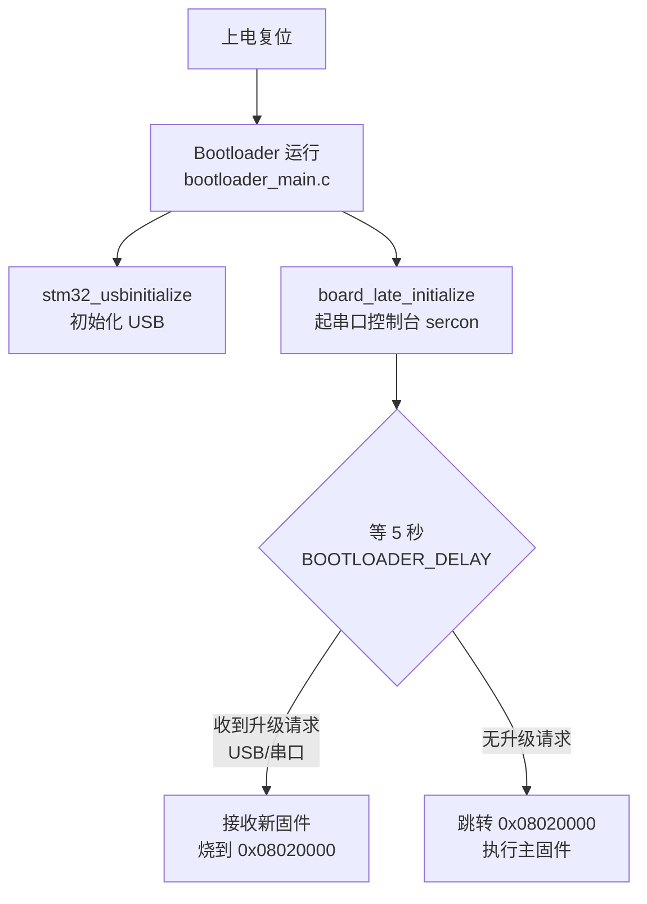
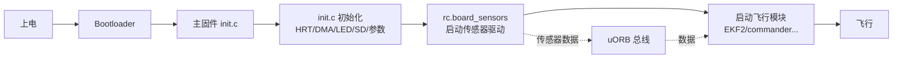

---
tags:
  - PX4
  - HKUST
  - BSP
  - 板级支持包
  - 传感器
  - STM32H743
date: 2026-08-19
---

# 代码解读：HKUST nxt-dual 板级支持包

> 本文解读 `PX4-Autopilot/boards/hkust/nxt-dual/` 整个文件夹的运作方式，重点讲清 **程序运行流程**、**传感器配置机制**，以及 **如何额外添加传感器并测试**。

---

## 一、整体定位：这个文件夹是什么

`boards/hkust/nxt-dual/` 是 PX4 的 **板级支持包（BSP, Board Support Package）**，作用是"让 PX4 飞控跑在一块 HKUST 自研飞控板上"。

三个关键事实：

| 事实 | 说明 |
|------|------|
| 芯片 | **STM32H743**（Cortex-M7，480MHz，2MB Flash） |
| 板子来源 | 从 **MatekH743-slim** 改出来的（见 `firmware.prototype` 的 description） |
| `dual` 含义 | **双 IMU** —— 两组 BMI088（陀螺仪+加速度计各 2 个），冗余设计 |

核心思想一句话：**飞行算法代码完全不知道板子长什么样**，它只通过 uORB 拿数据。换板子只需改这一个文件夹。

---

## 二、目录结构与职责总览

```
boards/hkust/nxt-dual/
├── default.px4board        ← 主固件配置：选哪些模块、串口分配
├── bootloader.px4board     ← 引导程序配置
├── firmware.prototype      ← 固件"身份信息"(board_id=1013、镜像大小)
├── extras/                 ← 预编译好的 bootloader 二进制
├── init/                   ← 上电启动 shell 脚本
│   ├── rc.board_defaults    ← 默认参数(机架、电池、姿态率)
│   ├── rc.board_sensors     ← ★ 启动传感器驱动
│   └── rc.board_extras      ← 额外设备(OSD/DShot 等)
├── nuttx-config/           ← NuttX 内核配置(时钟、驱动开关)
└── src/                    ← 真正的板级 C/C++ 代码
    ├── CMakeLists.txt       ← ★ 构建入口
    ├── init.c               ← 主固件启动初始化
    ├── bootloader_main.c    ← 引导程序启动
    ├── board_config.h       ← ★ 引脚/GPIO 宏定义
    ├── hw_config.h          ← 引导程序参数(flash 大小、加载地址)
    ├── spi.cpp              ← ★ SPI 总线设备表
    ├── i2c.cpp              ← ★ I2C 总线表
    ├── timer_config.cpp     ← PWM 定时器表
    ├── led.c                ← LED 控制
    ├── sdio.c               ← SD 卡驱动初始化
    ├── usb.c                ← USB 初始化
    ├── flash_w25q128.c      ← 外部 Flash 驱动
    ├── mtd.cpp              ← 存储设备(F-RAM)分区
    └── manifest.c           ← 硬件清单
```

---

## 三、完整程序运行流程（从开机到飞行）

### 3.1 一个文件夹，产出两个镜像

[src/CMakeLists.txt](boards/hkust/nxt-dual/src/CMakeLists.txt) 是整个 BSP 的**调度中心**，靠变量 `PX4_BOARD_LABEL` 决定编译哪一套：

```cmake
if("${PX4_BOARD_LABEL}" STREQUAL "bootloader")
    add_library(drivers_board bootloader_main.c usb.c)   # 引导程序：极简
else()
    add_library(drivers_board i2c.cpp init.c led.c sdio.c
                spi.cpp timer_config.cpp usb.c mtd.cpp)  # 主固件：全量
endif()
```

> **同一份板级目录 → 两个完全不同的二进制文件**：
> - `nxt-dual_bootloader` = 引导程序（只含 `bootloader_main.c` + `usb.c`）
> - `nxt-dual_default` = 飞控主固件（其余 8 个文件全编进去）

### 3.2 开机 → 引导程序



引导程序代码极简（[bootloader_main.c](boards/hkust/nxt-dual/src/bootloader_main.c) 才 76 行），因为它**不飞**，只干一件事：接收并烧写新固件，或跳转到已烧好的主固件。

### 3.3 主固件启动（init.c）

主固件入口是 [init.c](boards/hkust/nxt-dual/src/init.c) 里的 `board_app_initialize()`：

```c
__EXPORT int board_app_initialize(uintptr_t arg)
{
    px4_platform_init();             // ① 高精度时钟 HRT
    board_dma_alloc_init();          // ② DMA 内存池
    drv_led_start(); led_off(...);   // ③ LED
    stm32_sdio_initialize();         // ④ SD 卡挂载 (sdio.c)
    parameter_flashfs_init(...);     // ⑤ 参数存内部 flash
    px4_platform_configure();        // ⑥ ★ 按 manifest 配置硬件
    return OK;
}
```

### 3.4 执行启动脚本（rc.board_sensors）

硬件初始化完后，NuttX 的 **nsh** 会执行 ROMFS 里的启动脚本，其中板级部分就是 [init/rc.board_sensors](boards/hkust/nxt-dual/init/rc.board_sensors)：

```sh
board_adc start                              # 启动 ADC(电池电压/电流)
bmi088 -s -b 1 -A -R 2 start                 # SPI1 上的加速度计
bmi088 -s -b 1 -G -R 2 start                 # SPI1 上的陀螺仪
bmi088 -s -b 4 -A -R 2 start                 # SPI4 上的加速度计
bmi088 -s -b 4 -G -R 2 start                 # SPI4 上的陀螺仪
spl06 -X -a 0x77 start                       # I2C 地址 0x77 的气压计
```

### 3.5 启动飞行模块

最后根据 [default.px4board](boards/hkust/nxt-dual/default.px4board) 里 `CONFIG_MODULES_*` 的选择，启动飞行模块：

```
commander / EKF2 / mc_att_control / navigator / logger / mavlink ...
        └──────────► 无人机起飞
```

### 3.6 完整流程图



---

## 四、传感器配置机制（核心）

### 4.1 核心思想：表驱动（Table-Driven）

PX4 板级代码**不直接操作寄存器**，而是用一张张 **constexpr 配置表**描述硬件，通用驱动读表完成初始化。

传感器配置分 **三层**，必须逐层对应：

| 层 | 文件 | 配置什么 |
|----|------|---------|
| ① 引脚层 | `board_config.h` | 每个 GPIO 的电气定义 |
| ② 总线表 | `spi.cpp` / `i2c.cpp` | "哪个设备在哪条总线、哪个片选、哪根中断" |
| ③ 启动脚本 | `rc.board_sensors` | "上电启动哪个驱动、用哪条总线" |

### 4.2 第一层：引脚定义（board_config.h）

```c
/* 例：LED、ADC 等 GPIO 的电气属性 */
#define GPIO_OTGFS_VBUS  (GPIO_INPUT|GPIO_PULLDOWN|GPIO_SPEED_100MHz|GPIO_PORTD|GPIO_PIN0)
#define ADC_BATTERY_VOLTAGE_CHANNEL  ADC12_CH(4)
```

但注意：**SPI/I2C 的引脚不再写在这里**（老 PX4 是这样），新架构直接写在 `spi.cpp` 的总线表里。

### 4.3 第二层：总线设备表（spi.cpp / i2c.cpp）

[spi.cpp](boards/hkust/nxt-dual/src/spi.cpp) 声明了 4 条 SPI 总线：

```cpp
constexpr px4_spi_bus_t px4_spi_buses[SPI_BUS_MAX_BUS_ITEMS] = {
    initSPIBus(SPI::Bus::SPI1, {
        initSPIDevice(DRV_GYR_DEVTYPE_BMI088, SPI::CS{PortA,Pin3}, SPI::DRDY{PortA,Pin1}), // 陀螺仪1
        initSPIDevice(DRV_ACC_DEVTYPE_BMI088, SPI::CS{PortA,Pin2}, SPI::DRDY{PortA,Pin0}), // 加速度计1
    }),
    initSPIBus(SPI::Bus::SPI2, {
        initSPIDevice(SPIDEV_FLASH(0), SPI::CS{PortD,Pin4})   // 外部 Flash W25Q128
    }),
    initSPIBus(SPI::Bus::SPI3, { /* 预留 */ }),
    initSPIBus(SPI::Bus::SPI4, {
        initSPIDevice(DRV_GYR_DEVTYPE_BMI088, SPI::CS{PortC,Pin2}, SPI::DRDY{PortE,Pin3}), // 陀螺仪2
        initSPIDevice(DRV_ACC_DEVTYPE_BMI088, SPI::CS{PortC,Pin13}, SPI::DRDY{PortE,Pin4}),// 加速度计2
    }),
};
```

- **`SPI::Bus::SPI1`** → 对应脚本里的 `-b 1`
- **`SPI::CS{PortA,Pin3}`** → 片选信号引脚
- **`SPI::DRDY{PortA,Pin1}`** → 数据就绪中断引脚（陀螺仪采样完成会拉电平通知 MCU）
- **`DRV_GYR_DEVTYPE_BMI088`** → 设备类型 ID，驱动靠它识别"这是 BMI088 陀螺仪"

> 这就是 **"dual"** 的来源：SPI1 一套 BMI088 + SPI4 又一套 BMI088 = 2 陀螺 + 2 加速度计。

[i2c.cpp](boards/hkust/nxt-dual/src/i2c.cpp) 同理，更简单：

```cpp
constexpr px4_i2c_bus_t px4_i2c_buses[I2C_BUS_MAX_BUS_ITEMS] = {
    initI2CBusExternal(1),   // I2C1 → 外接磁力计/GPS
    initI2CBusExternal(4),   // I2C4 → 板载 spl06 气压计(0x77)
};
```

### 4.4 驱动如何找到设备（关键机制）

启动脚本里的 `bmi088 -s -b 1 -A -R 2 start` 这条命令，最终进到 [bmi088_main.cpp](src/drivers/imu/bosch/bmi088/bmi088_main.cpp)：

```cpp
// 解析参数：-s=SPI, -b=总线号, -A=加速度计, -G=陀螺仪, -R=旋转
while ((ch = cli.getOpt(argc, argv, "AGR:")) != EOF) {
    case 'A': type = DRV_ACC_DEVTYPE_BMI088;  break;
    case 'G': type = DRV_GYR_DEVTYPE_BMI088;  break;
    ...
}
BusInstanceIterator iterator(name, cli, type);  // ★ 用类型去总线表里找设备
ThisDriver::module_start(cli, iterator);
```

`BusInstanceIterator` 会**扫描 `px4_spi_buses[]` 这张表**，找出所有 `type` 匹配的设备，然后为每个设备实例化一个驱动。所以：

> **你只需在表里"声明"一个设备，驱动就会自动发现它** —— 这正是表驱动的威力。驱动代码（bmi088 驱动）完全不改，就能适配新板子。

总线表的消费发生在通用代码 [platforms/nuttx/.../spi/spi.cpp](platforms/nuttx/src/px4/stm/stm32_common/spi/spi.cpp) 的 `stm32_spiinitialize()`：

```cpp
for (int i = 0; i < SPI_BUS_MAX_BUS_ITEMS; ++i) {
    switch (px4_spi_buses[i].bus) {
    case 1: _spi_bus1 = &px4_spi_buses[i]; break;
    case 4: _spi_bus4 = &px4_spi_buses[i]; break;
    ...
    }
}
```

### 4.5 传感器数据流


---

## 五、Demo：BMI088 双 IMU 完整解析

以这块板最典型的双 IMU 为例，把三层配置串起来看：

| 步骤 | 文件 | 内容 | 作用 |
|------|------|------|------|
| 1 | `spi.cpp` | `initSPIBus(SPI1, {initSPIDevice(DRV_GYR_DEVTYPE_BMI088, CS{PA3}, DRDY{PA1})...})` | 声明 SPI1 上有 BMI088 |
| 2 | `spi.cpp` | `initSPIBus(SPI4, {...})` | 声明 SPI4 上有第二套 |
| 3 | `rc.board_sensors` | `bmi088 -s -b 1 -G -R 2 start` | 启动 SPI1 的陀螺仪 |
| 4 | `rc.board_sensors` | `bmi088 -s -b 4 -A -R 2 start` | 启动 SPI4 的加速度计 |
| 5 | `default.px4board` | `CONFIG_DRIVERS_IMU_BOSCH_BMI088=y` | 把驱动编进固件 |

**`-R 2` 是旋转矩阵索引**：告诉驱动"这颗芯片在板子上的物理朝向转了 90°"，驱动会据此把传感器坐标旋转到机体坐标。

---

## 六、如何额外添加一个传感器并测试（完整教程）

### 6.1 通用流程（以 I2C 磁力计为例）

假设你要加一颗 I2C 磁力计（如 IST8310），地址 0x0E，接在 I2C1 上：

#### Step 1：确认硬件接线

- I2C1 的 SDA/SCL 接到传感器
- 记下 I2C 地址（0x0E）

#### Step 2：确认驱动已存在

PX4 自带大量驱动，先看 `src/drivers/magnetometer/` 下有没有现成驱动。**有现成驱动就直接配置，无需写驱动代码**。

#### Step 3：启用驱动（default.px4board）

在 [default.px4board](boards/hkust/nxt-dual/default.px4board) 加一行：

```
CONFIG_DRIVERS_IST8310=y
```

#### Step 4：声明 I2C 总线（i2c.cpp）

在 [i2c.cpp](boards/hkust/nxt-dual/src/i2c.cpp) 确认 I2C1 已声明（这块板已声明了 `initI2CBusExternal(1)`）。如果传感器在一条新总线上，要加：

```cpp
initI2CBusExternal(3),   // 新增 I2C3
```

#### Step 5：启动驱动（rc.board_sensors）

在 [rc.board_sensors](boards/hkust/nxt-dual/init/rc.board_sensors) 加：

```sh
ist8310 -X -b 1 -a 0x0E start
```

#### Step 6：编译 + 烧录

```bash
make hkust_nxt-dual_default          # 编译主固件
```

烧录进板子（通过 USB 或串口，bootloader 会接收）。

#### Step 7：测试验证

上电后通过串口控制台（`/dev/ttyACM0`）或 QGC 的 MAVLink Console：

```sh
# ① 看驱动状态
ist8310 status

# ② 看实时数据(订阅 uORB 主题)
listener sensor_mag

# ③ 扫 I2C 总线，确认地址在线上
i2cdetect -b 1

# ④ 看启动日志有无报错
dmesg
```

### 6.2 如果是 SPI 传感器

改 [spi.cpp](boards/hkust/nxt-dual/src/spi.cpp)，加一条 `initSPIDevice`：

```cpp
initSPIBus(SPI::Bus::SPI3, {
    initSPIDevice(DRV_DEVTYPE_XXX, SPI::CS{PortX,PinY}, SPI::DRDY{PortX,PinZ}),
}),
```

然后在 `rc.board_sensors` 里：

```sh
xxx_driver -s -b 3 start
```

### 6.3 如果是全新的传感器（无现成驱动）

需要自己写驱动，工作量较大，基本套路（参考 `src/drivers/imu/bosch/bmi088/`）：

1. 建目录 `src/drivers/<类别>/<芯片名>/`
2. 写驱动类（继承 `SPI` 或 `I2C` 基类，实现 `init/read/measure`）
3. 写 `xxx_main.cpp`（用 `BusCLIArguments` + `BusInstanceIterator` 解析 `start/status/stop`）
4. 写 `CMakeLists.txt`（`px4_add_module`）
5. 在 `src/drivers/<类别>/CMakeLists.txt` 里 `add_subdirectory`
6. 在 `default.px4board` 加 `CONFIG_DRIVERS_XXX=y`
7. 在 `rc.board_sensors` 加启动行

### 6.4 测试三板斧总结

| 命令 | 作用 |
|------|------|
| `xxx status` | 驱动是否起来、采样率、错误计数 |
| `listener <topic>` | 实时看 uORB 数据流 |
| `i2cdetect -b N` / `dmesg` | 硬件层排查（总线扫描 / 启动日志） |

---

## 七、常见坑

| 坑 | 现象 | 解决 |
|----|------|------|
| 脚本总线号与表不匹配 | `-b 1` 但设备声明在 SPI4 | 脚本 `-b` 号 = `initSPIBus` 的 bus 号 |
| 忘了在 default.px4board 启用 | `xxx: command not found` | 加 `CONFIG_DRIVERS_XXX=y` |
| 设备类型 ID 写错 | 驱动找不到设备 | `initSPIDevice` 的 `DRV_*_DEVTYPE_*` 要和驱动 `type` 一致 |
| I2C 地址错 | `status` 报 read error | 用 `i2cdetect` 确认真实地址 |
| 旋转矩阵没设对 | 数据方向/姿态漂移 | 调 `-R` 参数 |

---

## 八、总结

> **CMakeLists.txt 决定"编什么"，board_config.h 定义"引脚长什么样"，spi/i2c/timer 三张表描述"硬件怎么接"，init.c 负责"上电初始化什么"，rc.board_sensors 负责"启动哪些传感器"，default.px4board 决定"装哪些飞行模块"。**

这就是 PX4 的**硬件抽象精髓**：飞行算法（commander、EKF2…）**完全不知道**这是 MatekH743 还是 HKUST 板，它们只通过 uORB 拿数据。**加传感器 = 改表 + 加一行脚本 + 启用一个配置**，驱动代码通常一行都不用动。
