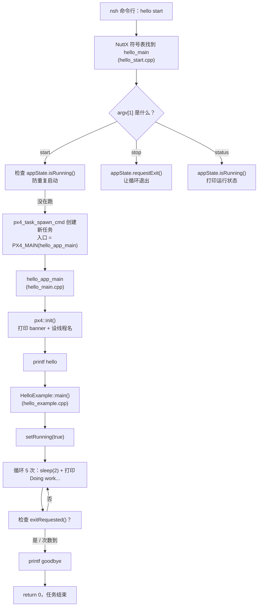

---
tags:
  - PX4
  - example
  - hello
  - 模块入口
  - PX4_MAIN
  - px4_task_spawn_cmd
date: 2026-08-24
---

# PX4 hello 示例：程序入口与执行流程

> 来源：`src/examples/hello/` 源码逐行解读

---

## 一、这个示例在做什么

`hello` 是 PX4 官方最经典的**最小示例模块**，它的作用只有一个：演示一个 PX4 模块**从「在 nsh 敲命令」到「执行完退出」的完整生命周期**。

在 SITL 的 nsh 里敲 `hello start` 后，它会打印：

```
process: hello          ← px4::init() 打印（NuttX 上）
hello                   ← hello_main.cpp 打印
  Doing work...         ← 循环体，共 5 次，每次间隔 2 秒
  Doing work...
  Doing work...
  Doing work...
  Doing work...
goodbye                 ← 循环结束打印
```

代码量极少，但**麻雀虽小五脏俱全**——它完整展示了 PX4 模块的几个核心机制：**命令分派、任务创建、优雅退出**。理解它，就能看懂所有更复杂的模块。

---

## 二、文件结构：4 个文件各司其职

```
src/examples/hello/
├── CMakeLists.txt        构建脚本：声明这是模块 hello，入口 MAIN=hello
├── Kconfig               菜单配置：EXAMPLES_HELLO 开关
├── hello_main.cpp        【任务体】PX4_MAIN 宏展开后的真正入口
├── hello_start.cpp       【命令入口】hello_main 函数：解析 start/stop/status
├── hello_example.cpp     【业务逻辑】HelloExample::main()：真正干活的循环
└── hello_example.h       类声明 + 静态 AppState
```

| 文件 | 角色 | 关键内容 |
|------|------|----------|
| `hello_main.cpp` | **任务体** | `PX4_MAIN` 函数（宏展开成 `hello_app_main`） |
| `hello_start.cpp` | **命令入口** | `hello_main()`：解析 `start`/`stop`/`status` |
| `hello_example.cpp` | **业务逻辑** | `HelloExample::main()`：打印 5 次 "Doing work..." |
| `hello_example.h` | **类声明** | `HelloExample` 类 + `static AppState appState` |

> [!note] 一个模块拆成「命令入口」+「任务体」+「业务逻辑」三层，是 PX4 的经典结构。

---

## 三、程序入口在哪：**两个入口**

这是最容易困惑的点。PX4 模块有**两个 main**，职责不同：

```cpp
// ① hello_start.cpp  —— 命令入口（nsh 里敲 hello 时被调用）
extern "C" __EXPORT int hello_main(int argc, char *argv[])
{
    if (!strcmp(argv[1], "start"))  { ... }   // 解析 start
    if (!strcmp(argv[1], "stop"))   { ... }   // 解析 stop
    if (!strcmp(argv[1], "status")) { ... }   // 解析 status
}

// ② hello_main.cpp  —— 任务体（start 时被 ① 创建的新任务执行）
int PX4_MAIN(int argc, char **argv)          // PX4_MAIN = hello_app_main
{
    px4::init(argc, argv, "hello");
    printf("hello\n");
    HelloExample hello;
    hello.main();                             // 真正干活
    printf("goodbye\n");
    return 0;
}
```

### 入口 1：`hello_main`（命令入口）

- 定义在 [hello_start.cpp:40](../../PX4-Autopilot/src/examples/hello/hello_start.cpp#L40)
- 前面有 `extern "C" __EXPORT`：
  - `extern "C"`：让符号不被 C++ 名字修饰（name mangling），nsh 才能按 `hello_main` 找到它
  - `__EXPORT`：`__attribute__((visibility("default")))`，把符号导出到符号表
- **当你在 nsh 敲 `hello start`，NuttX 的 shell 从符号表找到 `hello_main` 并调用它**，`argv[0]="hello"`，`argv[1]="start"`

### 入口 2：`PX4_MAIN`（任务体）

- 定义在 [hello_main.cpp:45](../../PX4-Autopilot/src/examples/hello/hello_main.cpp#L45)
- `PX4_MAIN` 是一个**宏**，由 CMake 在编译时定义：`PX4_MAIN = hello_app_main`
- 所以 `int PX4_MAIN(...)` 实际上就是 `int hello_app_main(...)`
- 它**不是**直接被 nsh 调用的，而是被入口 1 用 `px4_task_spawn_cmd` 当作新任务的入口函数启动

> [!tip] 一句话记法
> `hello_main` 是**前台**（nsh 直接调你，处理命令），`hello_app_main`（`PX4_MAIN`）是**后台任务**（start 后另起一个线程跑）。

---

## 四、整体执行流程

以 `hello start` 为例：



### 用 ASCII 版（Obsidian 外也能看）

```
nsh: hello start
   │
   ▼
hello_main(argc=2, argv=["hello","start"])        ← 命令入口（hello_start.cpp）
   │  strcmp(argv[1],"start")==0
   ├─ 若 appState.isRunning() → 打印 "already running" 返回
   │
   └─ px4_task_spawn_cmd("hello", ..., PX4_MAIN, &argv[2])
          │  创建独立任务，入口 = hello_app_main
          ▼
hello_app_main()                                  ← 任务体（hello_main.cpp，PX4_MAIN 宏）
   ├─ px4::init(argc, argv, "hello")  打印 banner、设线程名
   ├─ printf("hello")
   ├─ HelloExample hello;  hello.main()           ← 业务逻辑（hello_example.cpp）
   │      ├─ appState.setRunning(true)
   │      └─ while (!exitRequested() && i<5)
   │              ├─ px4_sleep(2)
   │              └─ printf("  Doing work...")
   ├─ printf("goodbye")
   └─ return 0
```

---

## 五、关键机制逐行拆解

### 1. `PX4_MAIN` 宏是怎么来的

`hello_main.cpp` 里写的是 `PX4_MAIN`，但它不是 C++ 内置的东西，而是 CMake 在编译时注入的。

CMakeLists.txt 里有：

```cmake
px4_add_module(
    MODULE examples__hello      # 模块唯一名
    MAIN hello                  # ← 关键：这决定 PX4_MAIN 展开成 hello_app_main
    SRCS
        hello_main.cpp
        hello_start.cpp
        hello_example.cpp
    DEPENDS                     # 空 = 静态模块，编进 px4 主程序
)
```

在 `cmake/px4_add_module.cmake` 里，`MAIN hello` 会生成：

```cmake
target_compile_definitions(${MODULE} PRIVATE PX4_MAIN=hello_app_main)
```

于是编译 `hello_main.cpp` 时，`PX4_MAIN` 被替换成 `hello_app_main`，函数真正签名是 `int hello_app_main(int argc, char **argv)`。

> [!note] `DEPENDS` 为空 → 静态模块
> 对比之前看的 `dyn_hello`，它的 `DEPENDS DYNAMIC` → 动态模块（`.px4mod`）。这里为空 → **静态模块**，直接编译进 `px4` 二进制，所以能用 `hello start` 而不是 `dyn ... start`。

### 2. `px4::init()` 做了什么

声明在 `platforms/common/include/px4_platform_common/init.h`，实现按平台分两个版本：

| 平台 | 实现位置 | 行为 |
|------|----------|------|
| NuttX（真机） | `px4_nuttx_impl.cpp` | 只打印一行 `process: hello` |
| POSIX（SITL） | `px4_posix_impl.cpp` | 打印 PX4 ASCII logo + `hello starting.`，并 `pthread_setname_np` 设线程名 |

它就是**打印欢迎语 + 给线程起个名**，方便 `top` / 调试时识别，没有实际初始化逻辑。

### 3. `px4::AppState` —— 优雅退出

定义在 `app.h`，是个极简状态类：

```cpp
class AppState {
    bool exitRequested() { return _exitRequested; }   // 有人让我退出吗？
    void requestExit()   { _exitRequested = true; }   // 请求退出
    bool isRunning()     { return _isRunning; }       // 我在跑吗？
    void setRunning(bool r) { _isRunning = r; }
    bool _exitRequested;
    bool _isRunning;
};
```

用法：`HelloExample` 里声明了一个**静态成员** `appState`（在 `hello_example.cpp:43` 定义 `px4::AppState HelloExample::appState;`），相当于**全局单例**。这样：

- 任务体（`hello_app_main` 跑的循环）读 `appState.exitRequested()` 决定是否退出
- 命令入口（`hello_main` 处理 `stop`）写 `appState.requestExit()`

**两个不同的线程通过这个静态对象通信**，实现「前台敲 stop → 后台任务优雅退出」。

### 4. `px4_task_spawn_cmd` —— 创建任务

`hello_start.cpp` 里 start 的核心：

```cpp
daemon_task = px4_task_spawn_cmd(
    "hello",                    // 任务名
    SCHED_DEFAULT,              // 调度策略
    SCHED_PRIORITY_MAX - 5,     // 优先级
    2000,                       // 栈大小（字节）
    PX4_MAIN,                   // 入口函数 = hello_app_main
    (char *const *)&argv[2]);   // 传给新任务的参数（跳过 "hello" "start"）
```

它创建一个**新的 NuttX 任务（线程）**，从 `hello_app_main` 开始执行。注意参数 `&argv[2]`：`hello start foo` 时，新任务收到的 argv 是 `["foo"]`。

### 5. `start` / `stop` / `status` 三个命令

| 命令 | 逻辑 | 作用 |
|------|------|------|
| `hello start` | 检查 `isRunning()` → 防重复；否则 `px4_task_spawn_cmd` | 创建后台任务 |
| `hello stop` | `appState.requestExit()` | 让后台循环退出 |
| `hello status` | `appState.isRunning()` | 打印 "is running" / "not started" |

---

## 六、和你的 `test_app` 对比（两种写法）

你之前自己写的 `test_app` 用的是**新框架 `ModuleBase`**，和 `hello` 的**旧写法**思路一致、结构不同：

| 维度 | `hello`（旧写法） | `test_app`（ModuleBase 新写法） |
|------|------------------|-------------------------------|
| 命令入口 | 手写 `hello_main` + `strcmp` 解析 | `ModuleBase::main` 框架自动分发 |
| 任务体 | `PX4_MAIN` + `px4::init` | `ModuleBase::run()` 虚函数 |
| 任务创建 | 手写 `px4_task_spawn_cmd` | `px4_task_spawn_cmd` 封装在 `task_spawn` |
| 退出控制 | 手写 `px4::AppState` | `ModuleBase` 内置 `should_exit()` |
| 参数处理 | 无 | 内置 `Param` 类 |

结论：**新模块建议用 `ModuleBase`（像 test_app 那样），`hello` 更多是教学用途**——它把框架帮你藏起来的细节（命令解析、任务创建、退出标志）**手动暴露**出来，所以更适合理解原理。

---

## 七、怎么测试

`hello` 已在 SITL 默认启用（`boards/px4/sitl/default.px4board:71` 的 `CONFIG_EXAMPLES_HELLO=y`）。

```bash
make px4_sitl gazebo
```

进入 nsh 后：

```bash
hello start      # 启动：打印 hello → Doing work... ×5 → goodbye
hello status     # 查看是否在运行
hello stop       # 优雅停止（循环还在跑时提前退出）
hello            # 不带参数 → 打印 usage
```

> [!tip] 观察优雅退出
> 先 `hello start`，趁它还在 sleep 时敲 `hello stop`，你会看到循环提前结束——这就是 `AppState::requestExit()` 在起作用。

---

## 八、一句话总结

> PX4 模块 = **命令入口（`hello_main`）** + **任务体（`PX4_MAIN` = `hello_app_main`）** + **业务逻辑（`HelloExample::main`）**。
> nsh 敲 `hello start` → 命令入口解析 → `px4_task_spawn_cmd` 起新任务 → 任务体执行 → 通过 `AppState` 静态对象实现 `stop` 优雅退出。
