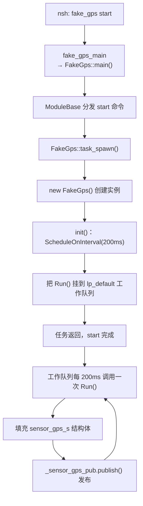

---
tags:
  - PX4
  - example
  - fake_gps
  - uORB
  - ModuleBase
  - ScheduledWorkItem
  - preflight
date: 2026-08-24
---

# PX4 fake_gps 示例：伪造 GPS 与 preflight 报错分析

> 来源：`src/examples/fake_gps/` 源码逐行解读

---

## 一、这个示例在做什么

`fake_gps` 是一个**伪造 GPS 传感器**的示例模块：它不读任何真实硬件，而是**周期性地往 `sensor_gps` 这个 uORB 主题上发布一组写死的 GPS 数据**（固定经纬度、海拔、卫星数、定位精度等）。

它的教学价值在于演示 PX4 里**最经典的三件事**：

1. 用 `ModuleBase` 框架写模块（和你的 `test_app` 是同一套新框架）
2. 用 `ScheduledWorkItem`（工作队列定时任务）实现「每隔固定时间跑一次」
3. 用 `uORB::PublicationMulti` 发布传感器话题

> [!warning] 一句话定位
> `fake_gps` 只是「假装有一个 GPS」，它**不会**让飞机变得能解锁、能飞。后面那几条 preflight 报错正是这个原因（见第六节）。

---

## 二、文件结构

```
src/examples/fake_gps/
├── CMakeLists.txt        构建脚本：MAIN fake_gps，依赖 px4_work_queue
├── Kconfig               菜单配置：EXAMPLES_FAKE_GPS 开关
├── FakeGps.hpp           类声明
└── FakeGps.cpp           实现（任务生成 + 定时发布）
```

比 `hello` 更紧凑——**没有拆「命令入口 / 任务体 / 业务逻辑」三个文件**，因为 `ModuleBase` 框架已经帮它把命令解析、任务创建这些模板代码都封装好了。

---

## 三、程序入口在哪

入口只有一个：`fake_gps_main`，在 [FakeGps.cpp:105](../../PX4-Autopilot/src/examples/fake_gps/FakeGps.cpp#L105)

```cpp
extern "C" __EXPORT int fake_gps_main(int argc, char *argv[])
{
    return FakeGps::main(argc, argv);   // 委托给 ModuleBase 框架处理
}
```

- `extern "C" __EXPORT`：导出符号，nsh 敲 `fake_gps` 时找到它
- 它只做一件事：把控制权交给 `FakeGps::main()`——这是 `ModuleBase` 模板基类提供的静态方法

**注意和 `hello` 的区别**：`hello` 的 `hello_main` 是手写的（要自己 `strcmp` 解析 start/stop/status）；而 `fake_gps` 的命令解析是 `ModuleBase` 框架自动完成的。你的 `test_app` 也是这种写法。

---

## 四、类设计：三种继承各司其职

[FakeGps.hpp:45](../../PX4-Autopilot/src/examples/fake_gps/FakeGps.hpp#L45)

```cpp
class FakeGps : public ModuleBase<FakeGps>, public ModuleParams, public px4::ScheduledWorkItem
```

| 基类 | 作用 |
|------|------|
| `ModuleBase<FakeGps>` | 模块框架：`main()` 命令分发、`task_spawn`/`custom_command`/`print_usage` 模板 |
| `ModuleParams` | 参数系统支持（这里没用到具体参数，但保留了能力） |
| `px4::ScheduledWorkItem` | 工作队列定时任务：把 `Run()` 挂到 `lp_default` 工作队列上周期执行 |

关键成员（[FakeGps.hpp:64-72](../../PX4-Autopilot/src/examples/fake_gps/FakeGps.hpp#L64-L72)）：

```cpp
static constexpr uint32_t SENSOR_INTERVAL_US{1000000 / 5}; // 5 Hz（20万微秒=200ms）
uORB::PublicationMulti<sensor_gps_s> _sensor_gps_pub{ORB_ID(sensor_gps)}; // GPS 发布器
int32_t _latitude{296603018};    // 纬度，单位 1e-7 度
int32_t _longitude{-823160500};  // 经度，单位 1e-7 度
int32_t _altitude{30100};        // 海拔，单位 1e-3 米（毫米）
```

---

## 五、执行流程



### 逐行拆解

**① `task_spawn`（[FakeGps.cpp:66](../../PX4-Autopilot/src/examples/fake_gps/FakeGps.cpp#L66)）**

```cpp
int FakeGps::task_spawn(int argc, char *argv[])
{
    FakeGps *instance = new FakeGps();      // 用默认坐标创建实例
    _object.store(instance);                // 存到基类，框架用它管理生命周期
    _task_id = task_id_is_work_queue;       // 关键：告诉框架「我不是独立线程，是工作队列任务」

    if (instance->init()) {
        return PX4_OK;
    }
    ...
}
```

`_task_id = task_id_is_work_queue` 是重点——它表明这个模块**不单独开一个线程**，而是复用 PX4 的**低优先级工作队列**（`lp_default`），由队列调度器统一驱动。这比 `hello` 的 `px4_task_spawn_cmd`（新建独立线程）更省资源。

**② `init()`（[FakeGps.cpp:40](../../PX4-Autopilot/src/examples/fake_gps/FakeGps.cpp#L40)）**

```cpp
bool FakeGps::init()
{
    ScheduleOnInterval(SENSOR_INTERVAL_US);  // 每 200ms 调度一次 Run()
    return true;
}
```

`ScheduleOnInterval` 是 `ScheduledWorkItem` 提供的接口，作用就是「**每隔 200ms 在工作队列里执行一次 `Run()`**」。

**③ `Run()`（[FakeGps.cpp:45](../../PX4-Autopilot/src/examples/fake_gps/FakeGps.cpp#L45)）**——核心

```cpp
void FakeGps::Run()
{
    if (should_exit()) {          // 框架的退出标志（对应 stop）
        ScheduleClear();          // 取消调度
        exit_and_cleanup();       // 清理并退出
        return;
    }

    sensor_gps_s sensor_gps{};    // 零初始化一个 GPS 结构体
    sensor_gps.lat = _latitude;   // 填纬度
    sensor_gps.lon = _longitude;  // 填经度
    sensor_gps.alt = _altitude;   // 填海拔
    ...
    sensor_gps.fix_type = 4;      // 4 = 3D 定位（固定解）
    sensor_gps.satellites_used = 14;
    sensor_gps.vel_ned_valid = true;
    sensor_gps.timestamp = hrt_absolute_time();

    _sensor_gps_pub.publish(sensor_gps);   // 发布到 sensor_gps 主题
}
```

每次 `Run()` 都把**同一份写死的 GPS 数据**发布出去。其他模块（比如 EKF2）订阅 `sensor_gps` 就能收到这份假数据。

**④ 构造函数里的坐标缩放（[FakeGps.cpp:36](../../PX4-Autopilot/src/examples/fake_gps/FakeGps.cpp#L36)）**

```cpp
FakeGps::FakeGps(double latitude_deg, double longitude_deg, float altitude_m)
    : _latitude(latitude_deg * 10e6),    // 10e6 = 10×10⁶ = 1e7
      _longitude(longitude_deg * 10e6),
      _altitude(altitude_m * 10e2f)      // 10e2 = 10×10² = 1000
{ }
```

这里有个**容易看错的点**：`10e6` 是 C++ 科学计数法 `10 × 10⁶ = 1e7`，不是「10 后面 6 个 0」。目的是把「度」换算成「1e-7 度」的整数存储（避免浮点精度损失），把「米」换算成「毫米」。

默认坐标 `29.6603018, -82.3160500`（美国佛罗里达州盖恩斯维尔附近），海拔 30.1 米——这是 PX4 常用的测试坐标。

---

## 六、为什么 `fake_gps start` 后出现 preflight 报错

你看到的：

```
WARN  [health_and_arming_checks] Preflight Fail: height estimate not stable
WARN  [health_and_arming_checks] Preflight Fail: height estimate error
WARN  [health_and_arming_checks] Preflight Fail: position estimate error
```

### 报错从哪来

这三条来自 **EKF2 的健康检查**，文件在 [estimatorCheck.cpp](src/modules/commander/HealthAndArmingChecks/checks/estimatorCheck.cpp)，检查的是 EKF2 发布的 `estimator_status` 话题：

| 报错 | 触发条件 | 代码位置 |
|------|----------|----------|
| height estimate **not stable** | `estimator_status.pre_flt_fail_innov_height` 为真（高度新息失败） | [estimatorCheck.cpp:162-171](src/modules/commander/HealthAndArmingChecks/checks/estimatorCheck.cpp#L162-L171) |
| height estimate **error** | `hgt_test_ratio > COM_ARM_EKF_HGT`（高度新息测试比超限） | [estimatorCheck.cpp:199-216](src/modules/commander/HealthAndArmingChecks/checks/estimatorCheck.cpp#L199-L216) |
| position estimate **error** | `pos_test_ratio > COM_ARM_EKF_POS`（位置新息测试比超限） | [estimatorCheck.cpp:237-254](src/modules/commander/HealthAndArmingChecks/checks/estimatorCheck.cpp#L237-L254) |

### 什么是「新息测试比」

EKF（扩展卡尔曼滤波）的工作分两步：

1. **预测**：用 IMU（陀螺仪 + 加速度计）往前推状态
2. **校正**：用 GPS 位置、气压计高度、磁力计航向等测量值去修正预测

「**新息（innovation）**」= 测量值 − 预测值。「**测试比（test ratio）**」= 新息 ÷ 预期误差。如果这个比值持续 > 1（超过阈值），说明滤波器「很意外」——测量值和预测对不上，估计不可信。

### 为什么 fake_gps 解决不了

核心原因一句话：**EKF 需要 IMU + 气压计 + 磁力计 + GPS 一起融合才有效，而 `fake_gps` 只伪造了 GPS 一个传感器。**

具体到这三条：

1. **`height estimate not stable` / `height estimate error`** → 高度估计。PX4 的 EKF **高度主要靠气压计（barometer）**，GPS 高度只是辅助。但 `src/examples/` 里只有 `fake_gps`、`fake_imu`、`fake_magnetometer`，**根本没有 `fake_barometer`**。没有气压计，高度新息自然一直失败、测试比一直超限。

2. **`position estimate error`** → 位置估计。位置需要 GPS + IMU 融合。你只 `fake_gps start` 而没同时开 `fake_imu`，IMU 没数据，位置也无法收敛；即便开了，一个**静止、写死坐标**的假 GPS 也无法让 EKF 收敛。

### 结论

> 这三条 WARN 是**正常且预期**的。`fake_gps` 是「学习怎么伪造 uORB 传感器话题」的教学 demo，**不是**让飞机通过自检、可以解锁的工具。

要消除这些报错、让飞机能解锁，只有两条路：

- **用完整仿真**（`make px4_sitl gazebo`），让 Gazebo 提供整套 IMU + 气压计 + 磁力计 + GPS，EKF 才能真正收敛
- **用真机**，真实传感器齐全

`fake_gps` / `fake_imu` / `fake_magnetometer` 这三个 fake 的用途是**单独测试某段代码路径**（比如「我的 GPS 解析逻辑对不对」），而不是拼出一架能飞的飞机。

> [!tip] 你可以做个实验
> 依次试 `fake_imu start`、`fake_magnetometer start`、`fake_gps start`，观察 preflight 报错的变化——你会发现**高度那两条始终消不掉**，因为缺气压计。这能帮你直观理解「EKF 依赖哪些传感器」。

---

## 七、和 `hello` 的对比

| 维度 | `hello`（旧写法） | `fake_gps`（新写法） |
|------|------------------|---------------------|
| 框架 | 裸 `PX4_MAIN` + `px4::init` | `ModuleBase` 模板 |
| 命令解析 | 手写 `strcmp` | 框架自动分发 |
| 任务机制 | `px4_task_spawn_cmd` 建独立线程 | `ScheduledWorkItem` 挂工作队列 |
| 周期执行 | 手写 `while + px4_sleep` | `ScheduleOnInterval` 自动调度 |
| 退出控制 | 手写 `px4::AppState` | 框架 `should_exit()` |
| uORB | 无 | `PublicationMulti<sensor_gps_s>` 发布 |

结论：**新模块一律用 `fake_gps` 这种 `ModuleBase + ScheduledWorkItem` 写法**，`hello` 是理解原理用的历史写法。

---

## 八、怎么测试

`fake_gps` 已在 SITL 默认启用（`boards/px4/sitl/default.px4board:68` 的 `CONFIG_EXAMPLES_FAKE_GPS=y`）。

```bash
make px4_sitl gazebo
```

nsh 里：

```bash
fake_gps start     # 开始每 200ms 发布一份假 GPS
listener sensor_gps   # 订阅 sensor_gps 主题，实时看假数据（或 uorb top）
fake_gps stop      # 停止
fake_gps status    # 查看运行状态
```

`listener sensor_gps`（或 `uorb top sensor_gps`）能直接看到 `fake_gps` 发布的 `lat/lon/alt/fix_type/satellites_used` 字段，这是验证「发布成功」最直观的方式。

---

## 九、一句话总结

> `fake_gps` = `ModuleBase` 模块 + `ScheduledWorkItem` 定时任务 + `PublicationMulti` 发布 `sensor_gps`。
> 它每 200ms 往 GPS 主题发一份写死的坐标，演示「怎么伪造一个传感器」。
> 那几条 preflight 报错是因为 **EKF 需要 IMU+气压计+磁力计+GPS 全套融合，单靠一个假 GPS 无法收敛**——这是预期行为，不是 bug。
